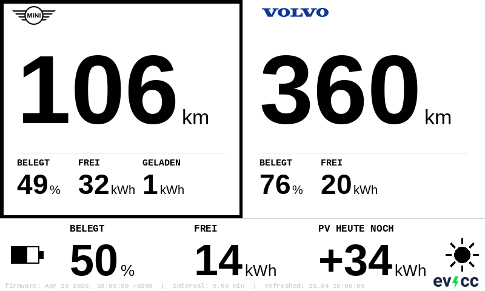

# evcc-Carport-Display

E-Ink display allowing me a quick glance of free battery space in my two BEVs and my Home Battery. As I have only have one wallbox/charger for two cars, this allows me to decide quickly how much energy to still expect today from my PV and which car to charge.



## Concept

evcc controls a KEBA wallbox and manages charging of a Mini Countryman E and a Volvo XC40 Recharge. Home Assistant aggregates vehicle data, home battery state and PV forecast into a single source of truth.

The project ships two variants of the same dashboard concept:

| Variant | File | Description |
|---------|------|-------------|
| **E-Ink display** | `carport_display.yaml` | ESPHome config for a Waveshare 7.5" display mounted at the carport entrance. Refreshes every few minutes, readable at 3 m distance. |
| **Lovelace card** | `lovelace_card.yaml` | Home Assistant `custom:button-card` mirroring the same layout at 75% scale with live sensor data. Requires [button-card](https://github.com/custom-cards/button-card) via HACS. |

Both variants share identical data sources, layout structure, and business logic (EVCC sensor priority, fallback to native vehicle APIs, active-vehicle highlighting).

Good base for a display case for 3D-printing: [Waveshare 7.5inch e-paper display case](https://www.thingiverse.com/thing:4204655)

## Gotchas / Open Issues
In my set-up the two cars are parked side by side, with chargeports being not even a meter apart. So unplugging one and plugging the other goes to quick for evcc to notice the change. I have reduced the evcc cycle to 15 seconds and wait a bit each time. This pause seem to be the only way to terminate the old charging session for the evcc history and start a new one.
Also the Mini seems not to support vehicle detection in evcc, so I do need to change to the Mini manually, as I care about propper charging history in evcc for each vehicle.

## Architecture

```
BMW CarData / Volvo API ──► Home Assistant
evcc (KEBA wallbox) ────────► Home Assistant ──► ESPHome (ESP32) ──► E-Ink Display
Victron / Solcast PV ──────► Home Assistant ──► Lovelace card
```

## Hardware (E-Ink variant)

| Component | Model |
|-----------|-------|
| Display | Waveshare 7.5" V2 (800×480 px, B/W) — `075BN-T7-D2` |
| Controller | Waveshare ESP32 Driver Board |
| Firmware | ESPHome, Arduino framework |
| Power | USB-C, mains-powered (permanent) |

## What it shows

**Per vehicle (top ¾)**
- Range in km — the dominant figure
- SOC % and free capacity (kWh)
- Energy charged this session (kWh) — shown when vehicle is connected
- Thick border around the vehicle currently at the wallbox

**Home energy (bottom ¼)**
- Home battery: SOC % and free capacity (kWh)
- PV forecast: remaining yield today (kWh)
- Footer (E-Ink only): firmware version, refresh interval, last refresh timestamp

## Data sources

| Value | Primary source | Fallback |
|-------|---------------|---------|
| Vehicle SOC / range | `sensor.evcc_carport_vehicle_soc` / `_range` | BMW CarData / Volvo API |
| Session energy | `sensor.evcc_carport_charged_energy` | — |
| Active vehicle | `select.evcc_carport_vehicle_name` | — |
| Home battery | `sensor.battery_percent` | — |
| PV forecast | `sensor.verbleibende_pv_produktion` | — |

evcc sensors are preferred when a vehicle is connected as they update more reliably during charging. The native vehicle API sensors serve as fallback when no vehicle is at the wallbox.

## Files

| File | Purpose |
|------|---------|
| `carport_display.yaml` | ESPHome device configuration for the E-Ink display |
| `lovelace_card.yaml` | HA Lovelace `custom:button-card` definition |
| `logo_mini_inv.png` | MINI wordmark, 1-bit inverted, 72×31 px |
| `logo_volvo_inv.png` | Volvo wordmark, 1-bit inverted, 110×15 px |
| `logo_evcc_inv.png` | evcc logo, 1-bit inverted, 80×22 px |

Logo PNGs must be placed in `/config/esphome/` alongside `carport_display.yaml`.

## Setup

### E-Ink display (`carport_display.yaml`)

1. Copy `carport_display.yaml` and the three logo PNGs to `/config/esphome/`
2. In the ESPHome UI: *New Device* → adopt the ESP32 board
3. Replace the generated YAML with `carport_display.yaml`
4. Adjust `wifi_ssid` / `wifi_password` in `secrets.yaml`
5. Run *Clean Build Files*, then *Install → Wirelessly*

The display registers a `number` entity **Display Refresh Interval** (0.03–60 min, step 0.01) in Home Assistant. Changing the value triggers an immediate refresh without reflashing.

ESPHome model: `7.50inv2p` — required for `full_update_every`.  
Busy pin: GPIO25, `inverted: true`.

> **Note:** After updating logo PNG files always run *Clean Build Files* before installing to avoid stale image cache.

### Lovelace card (`lovelace_card.yaml`)

1. Install [button-card](https://github.com/custom-cards/button-card) via HACS
2. In your HA dashboard: *Edit* → *Add Card* → *Manual*
3. Paste the contents of `lovelace_card.yaml`

No additional dependencies. Logos are embedded as Base64 data URIs directly in the YAML.

## Home Assistant card preview

The Lovelace card mirrors the E-Ink layout at 75% scale and updates live with every HA state change:

- Same two-column vehicle layout with brand logos
- Same bottom row for home battery and PV forecast
- Active vehicle highlighted with a thick border
- evcc logo bottom right
